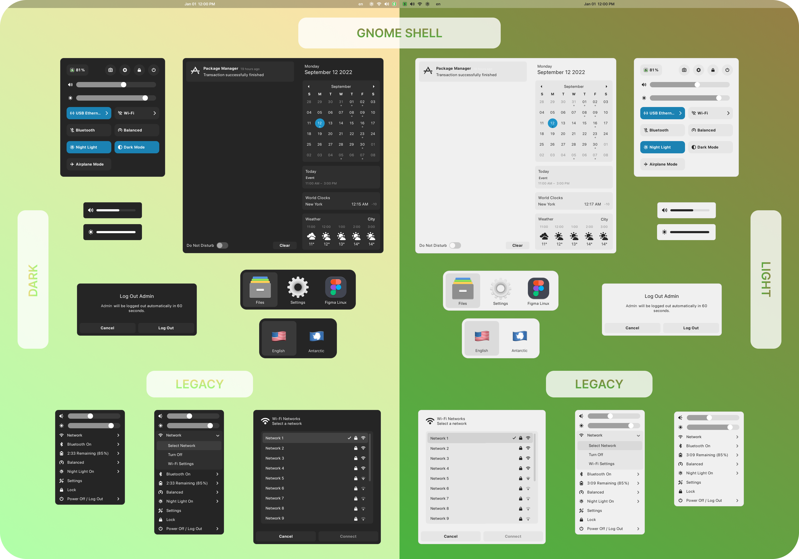

# Mono Theme for Gnome
Simple theme with nothing extra to use on a regular basis. Theme tested on Manjaro Linux and Fedora.

<p align="center"><b>Gtk4 apps</b></p>
<p align="center">
  
</p>

<p align="center"><b>Gtk3 apps</b></p>
<p align="center">
  
</p>

<p align="center"><b>Flatpak apps</b></p>
<p align="center">
  
</p>

<p align="center"><b>Gnome 43 apps</b></p>
<p align="center">
  
</p>

<p align="center"><b>Gnome-shell</b></p>
<p align="center">
  
</p>

## Support
[My Patreon](https://www.patreon.com/witalihirsch)

## Download
Download theme [here.](https://github.com/witalihirsch/Mono-gtk-theme/releases)

## Installation 
Move theme folders to `/home/user/.themes/`

### GTK4
To install the Gtk4 theme move the contents of `gtk4.0` to `home/user/.config/gtk4.0`

### Flatpak
To install themes on Flatpak apps use these commands:  
```pwsh
sudo flatpak override --filesystem=$HOME/.themes
```  
```pwsh
sudo flatpak override --env=GTK_THEME=MonoTheme
```
or
```pwsh
sudo flatpak override --env=GTK_THEME=MonoThemeDark
```

### Gnome-shell
To install the gnome-shell theme, move the entire theme folders to `/home/user/.themes`.

IMPORTANT! Take a snapshot of the system before use!  
If you want the gnome-shell theme to extend to the lock and login screen, move the `gnome-shell-theme.gresource` file from `gnome-shell` folder to `/usr/share/gnome-shell/` with a replacement and restart system with `ALT+F2` and enter `r` or reboot/log out for Wayland session.  
Command:
```pwsh
sudo cp gnome-shell-theme.gresource /usr/share/gnome-shell
```  
I recommend saving the `gresource` file from the folder to a safe place beforehand, if will need to be returned. Go to /usr/share/gnome-shell and open terminal:
```pwsh
sudo cp gnome-shell-theme.gresource /home/"username"/"desired directory"
``` 

### Using
The dark and light appearance of Gtk4 is changed by renaming the desired file to `gtk.css`. At the moment there is no or I haven't found another way to change the color.  
To change the light or dark theme of `Gtk3` apps and `Gnome-shell` use [Gnome Tweaks](https://gitlab.gnome.org/GNOME/gnome-tweaks) or [Night Theme Switcher](https://extensions.gnome.org/extension/2236/night-theme-switcher/) (choose the theme you want in the `Themes` tab and change the skin color in the Settings).
